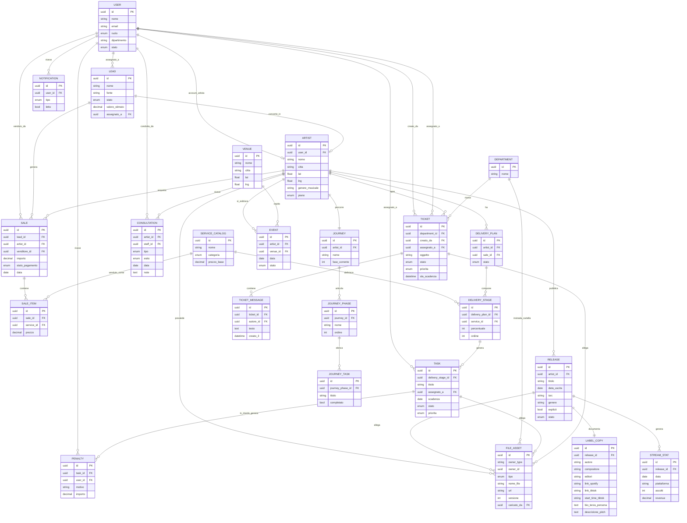

# Gestionale IMI — Architettura iniziale (v2)

> Blueprint tecnico per il gestionale su misura dell'agenzia: stack, schema dati e roadmap di rilascio.
> Fonti: brief funzionale (Sales/Delivery/Ticketing/Automazione/Booking), spec "Gestionale IMI Music" (demo_gestionale.pdf), screenshot di riferimento "My Caronte".

---

## 1. Contesto

Il sistema è un ibrido CRM/ERP con due macro-aree — **Sales** (acquisizione artisti) e **Delivery** (erogazione servizi) — più **Ticketing** interno e **Booking live**, governato da RBAC a isolamento rigido.

La spec "Gestionale IMI Music" descrive due gestionali distinti:

- **Gestione Team** — Amministratori e Dipendenti (con limitazioni), monitoraggio Delivery e task interni, calendario call, ricerca opportunità live.
- **Gestione Artisti** — staff + Artisti (con limitazioni), scambio materiale, monitoraggio promo/dati.

Due pattern del riferimento "Caronte" sono ripresi nello schema dati: il **Piano di Delivery** (pipeline a stadi per categoria di servizio: Distribuzione, Management, Advertising & Promo, Pitch & PR, Live, Branding) e il **Percorso** (piano editoriale a fasi con checklist e allegati, indipendente dai servizi venduti).

---

## 2. Moduli funzionali (spec "Gestionale IMI Music")

| Modulo                      | Accesso                                   | Contenuto                                                                                                                                                     | Entità coinvolte                               |
| --------------------------- | ----------------------------------------- | ------------------------------------------------------------------------------------------------------------------------------------------------------------- | ---------------------------------------------- |
| **Delivery / Info Artisti** | Amministratori, Dipendenti                | Contratto, servizi da erogare, live erogati/rifiutati/da erogare, consulenze per membro staff (gruppo/individuale/no-show)                                    | `ARTIST`, `SALE_ITEM`, `EVENT`, `CONSULTATION` |
| **Percorso + Calendario**   | Amministratori, Dipendenti                | Piano editoriale 12 mesi/4 fasi (Direzione artistica → Produzione audio → Artwork → Distribuzione/promo/live), calendario staff (call, assenze con preavviso) | `JOURNEY`, `JOURNEY_PHASE`, `JOURNEY_TASK`     |
| **Trova Live & Festival**   | Solo Amministratori                       | Ricerca opportunità live, proposta inoltrata e leggibile dall'artista                                                                                         | `EVENT` (stato: proposto/accettato/rifiutato)  |
| **Dashboard Artista**       | Amministratori, Artisti                   | Onboarding, profili social/DSP, monitoraggio ascolti/revenue, discografia, press kit                                                                          | `ARTIST`, `RELEASE`, `STREAM_STAT`             |
| **Distribuzione Materiale** | Amministratori, Artisti                   | Upload autonomo, cartelle condivise per ruolo (producer, grafico, video maker, fotografo, SMM), Label Copy completo                                           | `FILE_ASSET`, `RELEASE`, `LABEL_COPY`          |
| **Planning & Promozione**   | Solo Amministratori (lettura per artista) | Piano marketing/social, monitoraggio streaming/merch/live                                                                                                     | `TASK`, `STREAM_STAT`                          |

Trasversali: **Accortezze** (notifiche, scadenze, classifica ascolti, brano/EP del mese, rubrica team, recensioni Trustpilot), **Plus** (sezione didattica — video corsi, backlog).

### Regole di business da validare in app

| Regola                  | Vincolo                              | Dove si applica                          |
| ----------------------- | ------------------------------------ | ---------------------------------------- |
| Consegna materiale      | ≥35 giorni prima della pubblicazione | Validazione upload + reminder automatico |
| Bio / descrizione brano | Minimo 500 parole                    | Validazione form Label Copy              |
| Copertina               | 3000×3000 obbligatorio               | Validazione upload immagine              |
| Audio                   | WAVE 48.000/44.100 Hz — 24 bit       | Validazione upload master                |

---

## 3. Ruoli e permessi (RBAC)

Isolamento rigido a livello di vista e di API. Permessi su due livelli: ruolo macro (routing/autenticazione) + permesso di modulo (righe/colonne visibili), per introdurre in futuro sotto-ruoli (Setter/Closer, Finance, HR, BDM) senza reinventare l'RBAC.

| Ruolo                                              | Aree accessibili                                                   | Può                                                                                     | Non può                                              |
| -------------------------------------------------- | ------------------------------------------------------------------ | --------------------------------------------------------------------------------------- | ---------------------------------------------------- |
| **Admin**                                          | Tutte: Sales, Delivery, Ticketing, Booking, Finance, HR, audit     | Configurare ruoli, catalogo servizi, KPI aggregati di ogni dipartimento                 | —                                                    |
| **Sales** (venditore/scouter)                      | Lead, pipeline vendita, calendario, KPI personali                  | Creare/qualificare lead, chiudere vendite, vedere i propri incassi                      | Vedere ticket o file di delivery                     |
| **Operatori** (producer, videomaker, grafici, SMM) | Task assegnati, ticket del proprio dipartimento, file dei progetti | Aggiornare stato task, caricare asset, rispondere ai ticket                             | Vedere lead o incassi                                |
| **Artisti/Clienti**                                | Dashboard personale: servizi, percorso, file, ticket propri        | Aprire ticket, scaricare/caricare i propri asset, seguire l'avanzamento in sola lettura | Vedere altri artisti, KPI interni, prezzi di listino |

---

## 4. Stack tecnologico consigliato

Obiettivo: **monolite modulare** — confini di dominio netti (Sales, Delivery, Ticketing, Booking) in un'unica codebase, scomponibile in servizi separati solo quando un modulo lo giustifica per carico o team dedicato.

**Frontend**

- Next.js (App Router) + TypeScript
- Tailwind CSS + shadcn/ui (Radix)
- TanStack Query (dati server) + Zustand (stato locale)
- Recharts / Tremor per KPI e grafici
- Portale artista come PWA nella stessa codebase (app nativa → Fase 2)

**Backend**

- Node.js + NestJS (TypeScript), moduli per dominio: Sales, Delivery, Ticketing, Booking, Auth
- REST per il client web, webhook per integrazioni esterne
- Auth JWT + refresh token, guard RBAC a livello di route e di riga

**Dati & storage**

- PostgreSQL come DB primario, estensione **PostGIS** per la mappa geolocalizzata
- Object storage S3-compatibile (S3 / **Cloudflare R2** per l'egress) per master audio, video, grafiche — URL firmati + CDN
- Redis per cache, sessioni, code

**Automazione & realtime**

- BullMQ su Redis per assegnazione task, reminder scadenze, calcolo penalità
- WebSocket (Socket.io) per ticket e notifiche live
- Email transazionale (Resend/Postmark)

**Infrastruttura**

- Docker; hosting gestito (Railway/Render/Fly.io) fino a giustificare ECS/Kubernetes
- CI/CD GitHub Actions, ambienti dev/staging/prod
- Terraform quando l'infrastruttura si stabilizza

**Osservabilità**

- Sentry, log strutturati + audit trail, uptime monitoring sui moduli critici

> **Nota multi-tenant**: aggiungere fin da subito un campo `tenant_id` sulle tabelle principali tiene aperta l'opzione di rivendere il gestionale ad altre agenzie in futuro, senza migrazione di schema.

---

## 5. Schema entità-relazione

`FILE_ASSET` è polimorfico: si aggancia ad artista, task, ticket o release tramite `owner_type`/`owner_id`, così l'area cloud resta un unico sistema di upload/versioning.

`RELEASE`/`LABEL_COPY` separano lo storage grezzo (`FILE_ASSET`: master, copertina) dalla scheda metadati strutturata (ISRC, crediti, link DSP). `STREAM_STAT` è la serie storica ascolti/revenue per release e piattaforma.

`DELIVERY_PLAN` (pipeline dei servizi venduti) e `JOURNEY` (piano editoriale standard a 12 mesi) restano volutamente separati per non forzare ogni servizio dentro un'unica timeline rigida.

---

## 6. Roadmap a sprint

Sprint da 2 settimane, team di riferimento: 1 PM/PO, 2–3 full-stack, 1 designer part-time. L'MVP copre l'intero ciclo vendita→delivery→supporto in versione manuale/base; l'automazione (assegnazione automatica, penalità, gamification) è rimandata alla Fase 2, dopo aver validato i flussi manuali con il team reale.

### Fase 0 — Discovery & setup (Sprint 0, 2 settimane)

Repo, CI/CD, ambienti dev/staging/prod, schema DB v1, design system, RBAC skeleton, deploy "hello world" in staging.

### Fase 1 — MVP (Sprint 1–6, 12 settimane)

| Sprint | Contenuto                                                                                                                                                   |
| ------ | ----------------------------------------------------------------------------------------------------------------------------------------------------------- |
| 1      | Auth, RBAC (Admin/Sales/Operatori/Artisti), gestione utenti, CRUD Artisti, import/migrazione dati esistenti                                                 |
| 2      | Sales — tracking lead a kanban, assegnazione lead, registrazione vendite, cruscotto incassi giornaliero/mensile                                             |
| 3      | Sales — KPI per venditore, calendario condiviso per le chiamate, bacheca feedback                                                                           |
| 4      | Delivery core — catalogo servizi, Piano di Delivery, timeline avanzamento, task manuali, scheda Release + Label Copy                                        |
| 5      | File sharing & ticketing — area cloud con cartelle condivise per ruolo (producer, grafico, video maker, fotografo, SMM), ticketing interno per dipartimento |
| 6      | Portale artista & go-live — dashboard artista in sola lettura, notifiche email, QA, UAT, migrazione dati definitiva                                         |

### Fase 2 — Automazione & scala (Sprint 7–10+, 8+ settimane)

| Sprint | Contenuto                                                                                                                     |
| ------ | ----------------------------------------------------------------------------------------------------------------------------- |
| 7      | Assegnazione automatica dei task, scadenze, reminder via coda di job                                                          |
| 8      | Penalità/gamification — multe automatiche sui ritardi, segnalazioni, leaderboard                                              |
| 9      | Booking live — mappa geolocalizzata (PostGIS), filtri città/genere, venue e partnership, eventi; modulo Trova Live & Festival |
| 10     | KPI avanzati (Marketing, HR & Team, Finance, BDM), reportistica, audit log completo, classifica ascolti                       |

**Backlog oltre la Fase 2**: app mobile nativa, integrazione/import dati streaming e revenue dal distributore, sezione didattica "Plus", API pubblica multi-tenant per un'eventuale rivendita del gestionale.

---

## 7. Rischi e note aperte

| Area                         | Rischio                                                                                      | Mitigazione                                                                                                |
| ---------------------------- | -------------------------------------------------------------------------------------------- | ---------------------------------------------------------------------------------------------------------- |
| Migrazione dati              | Dati oggi su WhatsApp/fogli sparsi: import "sporco" rischia di inquinare l'MVP               | Export/pulizia dati come attività esplicita di Sprint 1                                                    |
| Costi storage                | Master audio e video sono file pesanti, i costi di egress su S3 crescono con l'uso           | Valutare Cloudflare R2 (egress gratuito) fin dal disegno iniziale                                          |
| Penalità automatiche         | Multe automatiche hanno implicazioni HR/contrattuali                                         | Validare la policy con HR/legale prima di Sprint 8; partire in modalità "solo segnalazione"                |
| Provider mappa               | Mapbox fattura a caricamento mappa: con centinaia di artisti può costare più del previsto    | Prototipare anche con Leaflet + OpenStreetMap                                                              |
| Adozione ticketing           | Sostituire WhatsApp per abitudine consolidata è un rischio di adozione                       | Finestra di doppio canale + formazione prima dello spegnimento di WhatsApp                                 |
| Monitoraggio ascolti/revenue | Nessun DSP offre API pubbliche di streaming/revenue a terzi                                  | Verificare cosa espone il distributore usato (export/API); fallback a inserimento manuale in `STREAM_STAT` |
| Regole di validazione        | I vincoli di formato/scadenza restano "regole scritte" se non applicati in modo verificabile | Validazione client+server sull'upload, agganciata al motore di reminder di Fase 2                          |

---

_Documento redatto a partire dal brief funzionale, dalla spec "Gestionale IMI Music" e dagli screenshot di riferimento forniti nel progetto. Versione pubblicata e navigabile: https://claude.ai/code/artifact/4798a3b3-2678-442f-b338-72ec0b9883bd_
